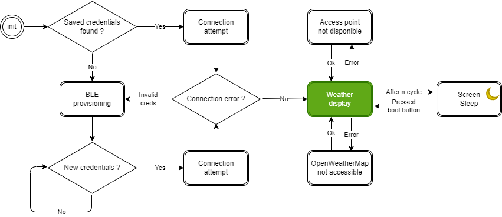

# esp32-oled-weather-station
 Station météo pour Wifi kit 32 V1 de chez Heltec (esp32 avec écran oled). Récupère les données météo de l'API OpenWeatherMap.
 
 Code inspiré du dépôt de JohannBro : https://github.com/JohannBro/OpenWeatherMap-WIFI-KIT-32

Ajout d'un système de provisioning BLE pour les crédentiels wifi.

